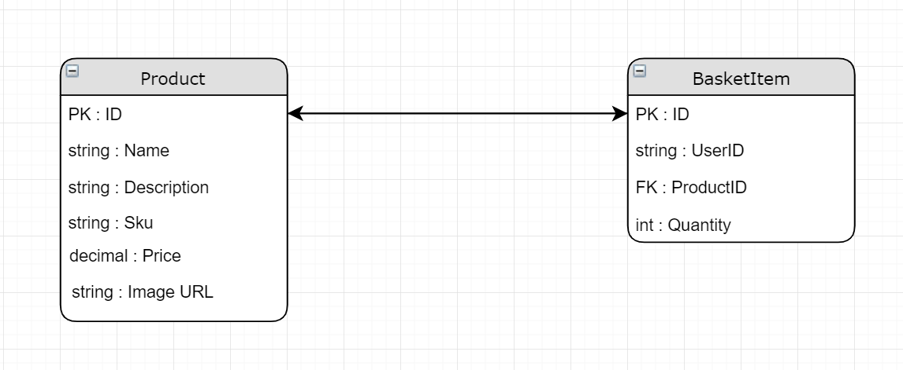

# Cook && Code E-Commerce Site

## Contributers
Jamilah McWilliams && Danul De Leon

## Version
- 3.0.0 : Sprint 3
- 2.0.0 : Sprint 2
- 1.0.0 : Sprint 1

## Description
This is an e-commerce site dedicated to cookware items with quirky code related merchandise.  It can vary from high tech gadgets that can be used in the kitchen, to an apron with a script printed on it on how to bake a cake, to T-Shirts with code memes.

## Claims
- First and Last Name: To be used later on in the site
- Email Domain: if .edu domain email is used, user is eligible for student discounts
- Favorite Coding Language: Will grant access to certain items in database.
- Admin Access: If a user registers with a .codefellows domain, they will be given the role of Administrator.

## Policies
- C# as favorite language: C# is special and allows users to see different items.
- Email domain, .edu is used for student discount page.
- Admin Access: If a user registers with a .codefellows domain, they will be given the role of Administrator.

## Database Schema

Our BasketItem table is essentially an Entity Join table with a payload of quantity.  These basket items are gathered by user ID and are used to contruct a shopping cart for each user.  Once the user is ready to checkout and purchase, an order item is created and the Order Id is updated to each BasketItem for future reference.

## Deployed Site
### https://ddanul.github.io/CookAndCode/

## Vulnerability Report
[Cook && Code Vulnerability Report](https://github.com/thejamilah/CookAndCode/blob/master/vulnerability-report.md)

